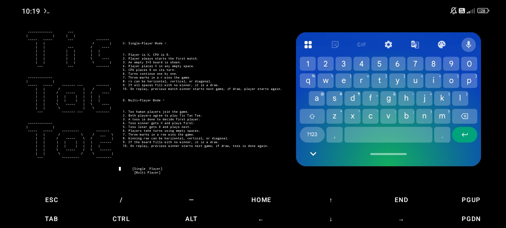
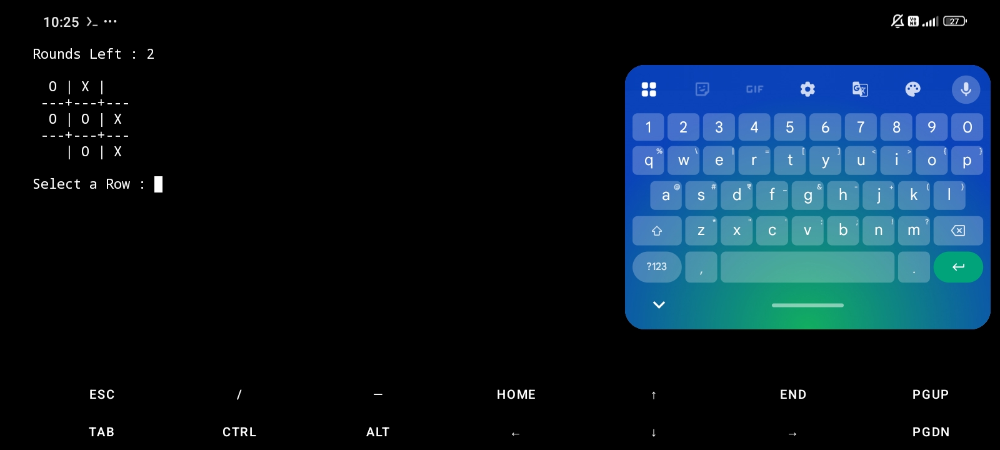

# Tic Tac Toe Game (C++)


Simple C++ terminal game project for practice and learning.

---

## Features

- Single Player mode (Player vs CPU)
- Multiplayer mode (2 players)
- 3×3 board in terminal
- Round tracking
- Win / Draw detection
- Simple text interface

---

## Demo

### Game Menu


### Gameplay


---

## How to Run

### 1. Compile

`g++ TicTacToe.cpp -o tic-tac-toe`<br>
or<br>
`clang++ TicTacToe.cpp -o tic-tac-toe`

### 2. Run

`./tic-tac-toe`

---

## How to Play

- Select Single Player or Multiplayer
- Enter row and column when asked
- First player to get 3 in a row wins
- If board is full → Draw

---

## Controls

- Use Arrow Keys to navigate in game menu
- Enter row number when asked
- Enter column number when asked
- Rows and columns range from 1 to 3

Board positions:
```
          Column
          1   2   3

Row 1       |   |
         ---+---+---
Row 2       |   |
         ---+---+---
Row 3       |   |
```
Example input:

Select Row: 2<br>
Select Column: 3

This places your mark at row 2, column 3.

---

## Requirements

- C++ compiler (clang++ / g++)
- Terminal (Windows / Linux / macOS / Termux)

---

## Author

AnimeBeast03 (Prathamesh)
